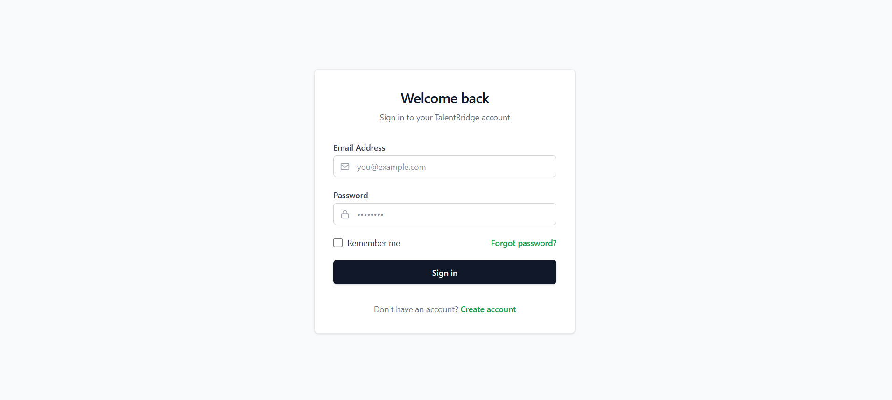
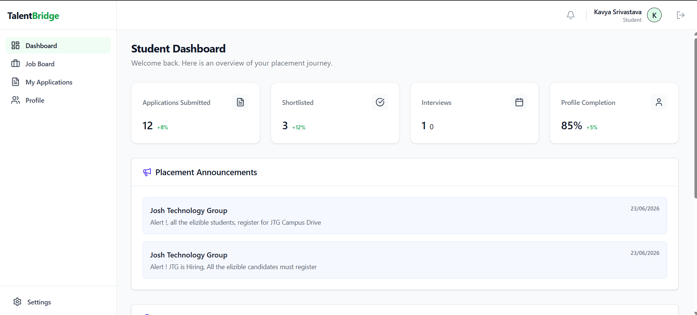
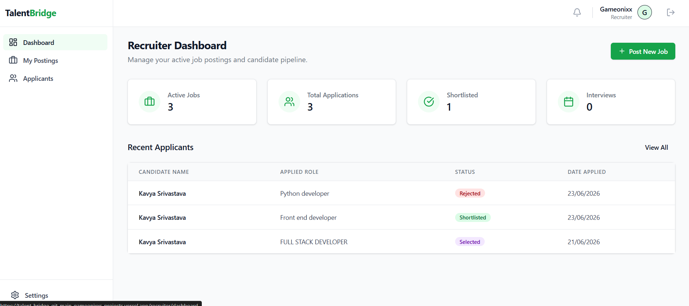
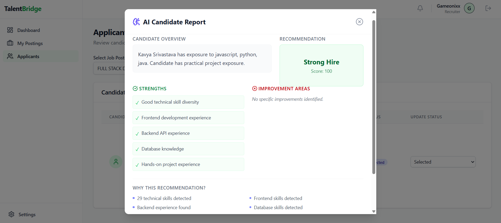
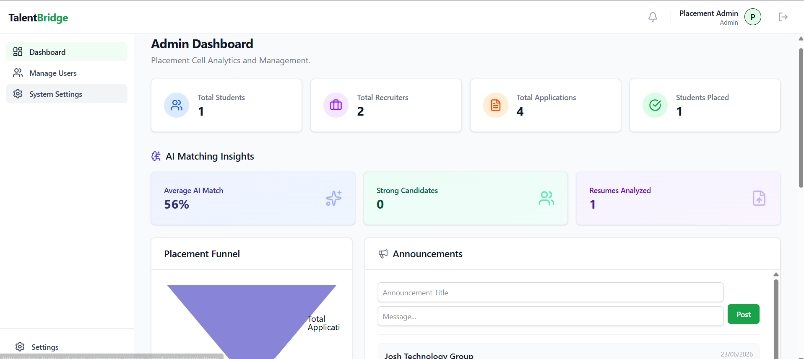

# 🚀 TalentBridge - AI Powered Placement Management Platform

TalentBridge is a full-stack AI-powered placement and recruitment management platform built to simplify college placement workflows.

It replaces traditional Excel sheets, forms, and manual tracking with a centralized system where students, recruiters, and placement administrators can manage the complete hiring process efficiently.


---

## 🌐 Live Demo

Frontend:
https://talent-bridge-kappa.vercel.app/

Backend API:
https://talentbridge-backend-kwe7.onrender.com/


---

# ✨ Key Features


## 👨‍🎓 Student Portal

- Secure student authentication
- Personalized dashboard
- Manage academic profile
- Upload resume
- Explore available jobs
- Apply for opportunities
- Track application status


---

## 🏢 Recruiter Portal

- Recruiter authentication
- Create and manage job openings
- View applications
- Analyze candidate profiles
- Resume preview support
- AI based candidate matching


---

## 🤖 AI Resume Intelligence

TalentBridge includes an intelligent resume analysis system:

- Resume parsing
- Skill extraction
- Candidate-job matching
- AI Match Score generation
- Missing skill detection
- Candidate recommendation insights


---

## 🛡️ Admin Portal

- Admin dashboard
- View platform statistics
- Manage students
- Manage recruiters
- Monitor placement activity


---

# 📱 Responsive Design

Fully responsive across:

- Desktop
- Tablet
- Mobile devices


Includes:

- Mobile sidebar navigation
- Responsive dashboards
- Optimized tables
- Mobile friendly forms


---

# 🛠️ Tech Stack


## Frontend

- React.js
- Vite
- Tailwind CSS
- Axios
- React Router


## Backend

- Node.js
- Express.js
- MongoDB
- Mongoose
- JWT Authentication
- Multer


## Deployment

Frontend:

- Vercel

Backend:

- Render

Database:

- MongoDB Atlas


---

# 🏗️ Architecture


```
Student
   |
Recruiter
   |
Admin
   |
   ↓
React Frontend
   |
REST APIs
   |
Express Backend
   |
MongoDB Database
   |
AI Matching Engine
```


---

# 📸 Screenshots


## Login Page




## Student Dashboard




## Recruiter Dashboard



## Recruiter Applicant Tracking


## Recruiter AI Interview Questions


## AI Analysis




## Admin Dashboard




---

# ⚙️ Installation


Clone the repository:

```bash
git clone https://github.com/YOUR_USERNAME/TalentBridge.git
```

Go inside project:

```bash
cd TalentBridge
```


---

# Backend Setup


```bash
cd backend

npm install

npm run dev
```


Create `.env` file:

```env
PORT=5000

NODE_ENV=development

MONGO_URI=your_mongodb_connection_string

JWT_SECRET=your_jwt_secret
```


---

# Frontend Setup


```bash
cd frontend

npm install

npm run dev
```


Create `.env` file:

```env
VITE_API_URL=http://localhost:5000
```


---

# 🔮 Future Improvements

- Advanced ML resume ranking
- Interview scheduling system
- Email notifications
- Recruiter-student chat
- Advanced analytics dashboard
- Multi-college support


---

# 👨‍💻 Developer

Developed by Kavya Srivastava

- Full Stack Development
- AI Integration
- MERN Stack
- Product Design


---

⭐ If you like this project, consider giving it a star.